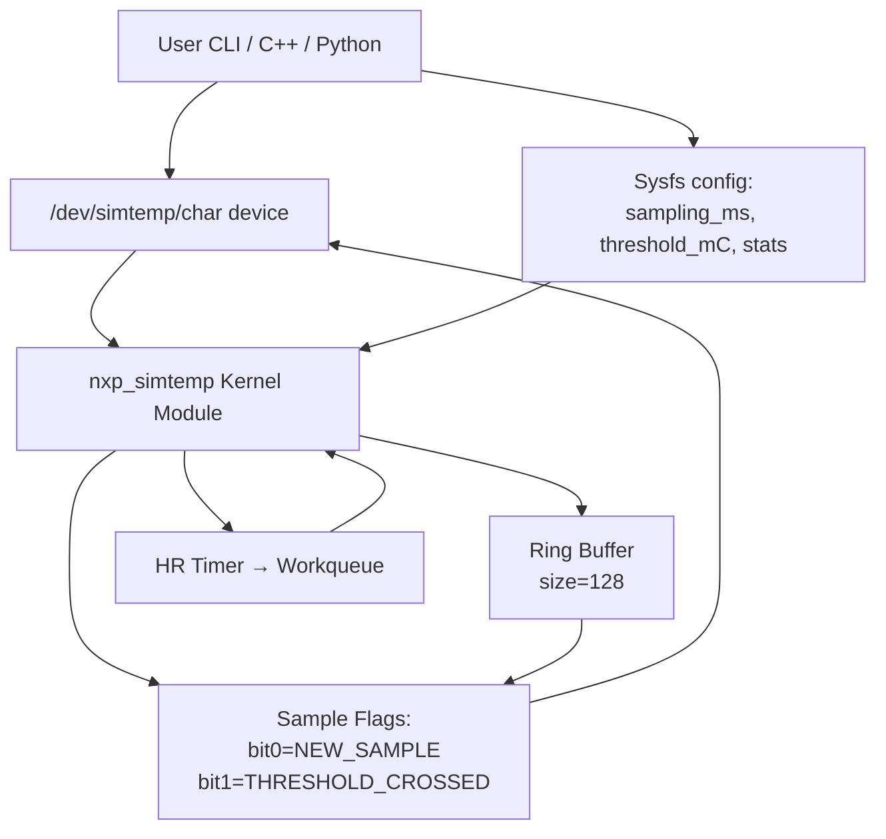

```mermaid
flowchart TD
  %% User space
  CLI["User CLI / C++ / Python"]
  DEV["/dev/simtemp/char device"]
  SYSFS["Sysfs config:\nsampling_ms, threshold_mC, stats"]

  %% Kernel driver internals
  DRIVER["nxp_simtemp Kernel Module"]
  RING["Ring Buffer\nsize=128"]
  TIMER["HR Timer → Workqueue"]

  %% Flags
  FLAGS["Sample Flags:\nbit0=NEW_SAMPLE\nbit1=THRESHOLD_CROSSED"]

  %% User interactions
  CLI --> DEV
  CLI --> SYSFS

  %% Device interactions
  DEV --> DRIVER
  SYSFS --> DRIVER

  %% Driver internals
  DRIVER --> RING
  DRIVER --> FLAGS
  DRIVER --> TIMER
  TIMER --> DRIVER

  %% Ring buffer logic
  RING --> FLAGS
  FLAGS --> DEV
```
