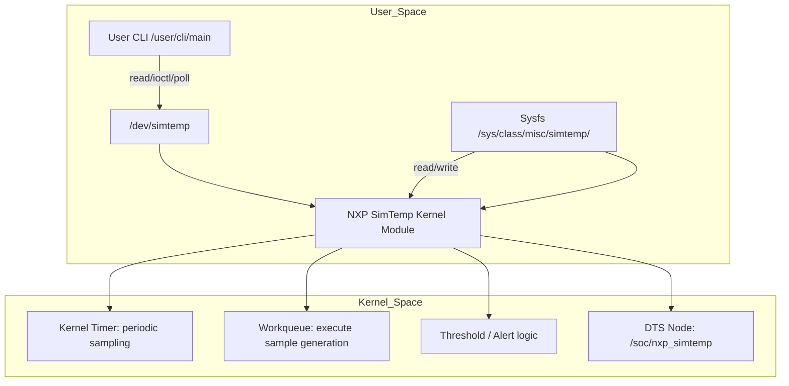

# ARCHITECTURE_DETAILED.md — nxp_simtemp

## 1. Overview

The `nxp_simtemp` driver simulates a temperature sensor on Linux. This document details the **kernel internals**, **user interfaces**, and **future Device Tree (DTS) integration**.

---

## 2. High-level Architecture



**Notes:**  
- The **DTS node** is currently a placeholder, for future integration.  
- Kernel timer → workqueue → sample generation → alerting → wakeup readers via poll().

---

## 3. Kernel Internals

### 3.1 Data Structures

| Structure | Purpose |
|-----------|---------|
| `struct temp_sample latest_sample` | Holds latest temperature + alert flags |
| `struct timer_list simtemp_timer` | Fires periodically to queue work |
| `struct workqueue_struct *simtemp_wq` | Dedicated workqueue |
| `struct work_struct simtemp_work` | Executes sampling outside timer context |

### 3.2 Locking

- **Spinlock (`spinlock_t`)** protects access to `latest_sample`.  
- Required because timer/workqueue updates and user-space reads happen concurrently.

### 3.3 Sampling & Alert Logic

- **Timer**: fires every `sampling_ms`, queues work to simulate temperature.  
- **Workqueue**: calculates new temperature, updates `latest_sample`.  
- **Alert**: compares against `threshold_mC`, sets alert flag if exceeded.  
- **Poll()**: wakes up any waiting user-space processes.

---

## 4. Device Tree (DTS)

- **Node:** `nxp-simtemp`  
- **Location:** `kernel/dts/nxp-simtemp.dtsi`  
- **Properties:**
```dts
nxp_simtemp: simtemp@0 {
    compatible = "nxp,simtemp";
    reg = <0x0 0x0 0x0 0x0>;   /* placeholder */
    sampling-ms = <1000>;
    threshold-mC = <42000>;
};
```
- **Purpose:** future embedded integration for automatic driver binding.

---

## 5. User Interfaces

### 5.1 Sysfs

| File | Description |
|------|------------|
| `sampling_ms` | Sampling interval in ms |
| `threshold_mC` | Alert threshold in milli-Celsius |
| `stats` | Number of samples taken / alerts triggered |

### 5.2 /dev Interface

| Method | Description |
|--------|------------|
| `read()` | Returns `struct simtemp_sample` |
| `poll()` | Triggers on new sample or alert |
| `ioctl()` | Binary API for automated test/CI |

---

## 6. CLI & Test Flow

- Normal mode: continuous logging of temperature + alerts.  
- `--test` mode:  
  - Forces low threshold.  
  - Verifies alert within ≤2 sample periods.  
- CLI interacts via `/dev/simtemp` and optionally uses sysfs or ioctl.

---

## 7. Concurrency Model

1. Timer fires periodically.  
2. Queues work in dedicated workqueue.  
3. Work updates `latest_sample` under spinlock.  
4. Multiple readers can `read()` concurrently; spinlock ensures data integrity.  
5. Alerts trigger poll() for event-driven user-space reaction.

---

## 8. Extensibility

- **Multiple sensors:** `/dev/simtemp0`, `/dev/simtemp1`, …  
- **Netlink interface** for async alert delivery.  
- **Real sensor integration:** replace simulation logic with ADC/I2C/SPI reads.  
- **Full DTS integration:** auto-bind on device tree parse.

---

## 9. Example Kernel + DTS Integration Flow

```text
Boot / User Module Load
        |
   Parse DTS Node (future)
        |
Kernel Timer fires periodically
        |
Queue work -> generate simulated sample
        |
Update latest_sample (spinlock protected)
        |
Compare against threshold
        |
If exceeded -> set ALERT + wake poll()
        |
User-space CLI reads /dev/simtemp or polls
```


