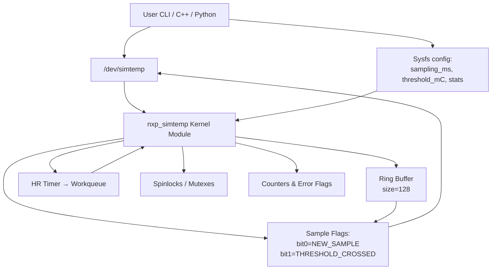

```mermaid
flowchart TD
    CLI["User CLI / C++ / Python"]
    DEV["/dev/simtemp"]
    SYSFS["Sysfs config:\nsampling_ms, threshold_mC, stats"]
    DRIVER["nxp_simtemp Kernel Module"]
    RING["Ring Buffer\nsize=128"]
    TIMER["HR Timer → Workqueue"]
    FLAGS["Sample Flags:\nbit0=NEW_SAMPLE\nbit1=THRESHOLD_CROSSED"]
    LOCKS["Spinlocks / Mutexes"]
    STATS["Counters & Error Flags"]

    CLI --> DEV
    CLI --> SYSFS
    DEV --> DRIVER
    SYSFS --> DRIVER
    DRIVER --> RING
    DRIVER --> FLAGS
    DRIVER --> TIMER
    TIMER --> DRIVER
    RING --> FLAGS
    FLAGS --> DEV
    DRIVER --> LOCKS
    DRIVER --> STATS
```
