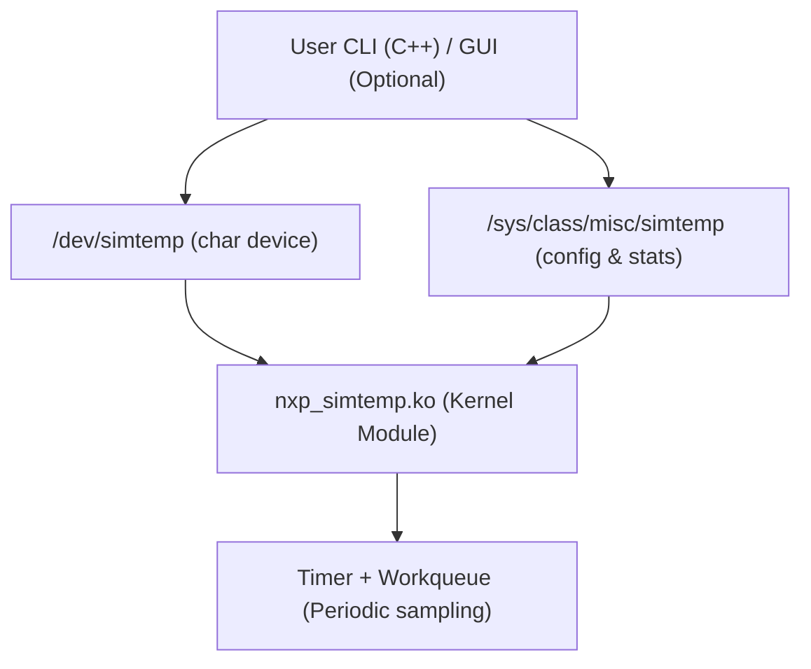
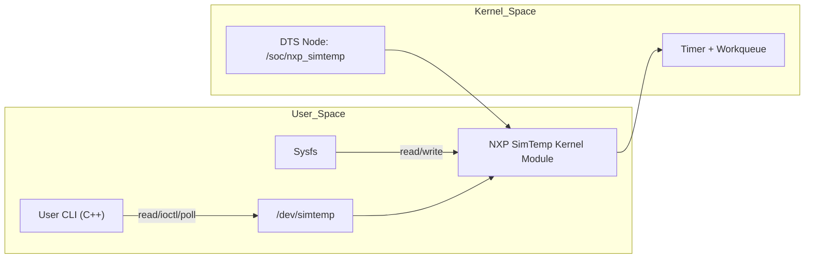

# DESIGN — nxp_simtemp

## 1. Overview

The `nxp_simtemp` driver is a **Linux miscdevice kernel module** that simulates
a temperature sensor device with the following features:

- Periodic sampling using a kernel timer + workqueue.
- User-space interface through:
  - `/dev/simtemp` (character device for reading samples).
  - `/sys/class/misc/simtemp/` (sysfs controls: sampling interval, threshold, stats).
  - `ioctl` commands defined in `nxp_simtemp_ioctl.h`.
- Device Tree (DTS) node placeholder (nxp-simtemp.dtsi) for future integration.
- Alert generation when temperature exceeds a configurable threshold.
- Self-test mode via the user CLI (`--test`).

This design balances **simplicity**, **extensibility**, and **Linux driver best practices**.

---

## 2. Architecture

### High-level Diagram

---

## 3. Kernel Module Design

### Data Structures
- **`struct temp_sample latest_sample;`**
  - Holds last sampled temperature + flags.
- **`struct timer_list simtemp_timer;`**
  - Periodic timer to schedule work.
- **`struct workqueue_struct *simtemp_wq;`**
  - Dedicated workqueue to handle sampling outside interrupt context.
- **`struct work_struct simtemp_work;`**
  - Work item executed periodically.

### Locking
- **Spinlock (`spinlock_t`)** protects access to `latest_sample`.
- Reason: sampling runs in workqueue + read() may run concurrently.

### Sampling
- Timer re-schedules itself with period `sampling_ms`.
- Each firing → queue work → simulate new temperature.

### Alerting
- Threshold compared against new sample.
- If exceeded, set `ALERT` flag in sample.
- `poll()` wakes up user processes.

---

## 4. Device Tree

- Node: nxp-simtemp
- Location: kernel/dts/nxp-simtemp.dtsi
- Properties:
  - compatible = "nxp,simtemp";
  - reg = <0x0 0x0 0x0 0x0>; (placeholder)
  - sampling-ms = <1000>; (default sample period)
  - threshold-mC = <42000>; (default threshold)

*Rationale:* future-proofing for embedded platforms; currently no DTS binding is implemented in the driver.

## 5. User Interfaces

### Sysfs
- `sampling_ms` → controls period (ms).
- `threshold_mC` → threshold in milli-Celsius.
- `stats` → debug info (samples taken, alerts generated).

*Rationale:* sysfs is natural for configuration knobs.

### /dev Interface
- **Read:** `struct simtemp_sample`
- **Poll:** triggers on new data
- **Ioctl:** alternative control channel for automated tests

*Rationale:* character device allows efficient event-driven usage.

---

## 6. User CLI

- Implements normal mode (continuous logging).
- Implements `--test` mode:
  - Forces low threshold.
  - Verifies alert within ≤2 sample periods.
- Acts as automated regression test.

---

## 7. Concurrency Model

- **Single-threaded timer → workqueue** ensures periodic execution.
- **Multiple readers** supported:
  - Each `read()` returns the latest sample.
- Locking ensures no data races.

---

## 8. Extensibility

Possible future improvements:
- Expose multiple sensors (`/dev/simtempX`).
- Add netlink interface for async alerts.
- Replace simulated data with real ADC/HW source.
- Implement DTS integration for embedded platforms

---

## 9. Design Decisions

1. **Miscdevice** instead of static major/minor
   - Auto-allocated minor.
   - Reduces conflicts and simplifies user-space setup.

2. **Workqueue vs Tasklet**
   - Workqueue chosen: allows sleeping operations if needed.
   - Safer for future expansion (I2C, SPI reads).

3. **Sysfs + Ioctl**
   - Sysfs: human-readable, script-friendly.
   - Ioctl: binary API, stable for automated test/CI.

4. **Timer period granularity**
   - Using `ms` for simplicity.
   - Kernel timer resolution may vary, but sufficient for test purpose.

---

## 10. Example Interaction

$ sudo insmod nxp_simtemp.ko
$ ls /dev/simtemp
/dev/simtemp
$ echo 200 > /sys/class/misc/simtemp/sampling_ms
$ echo 42000 > /sys/class/misc/simtemp/threshold_mC
$ ./simtemp_cli
2025-10-03T20:00:01Z temp=41.5C alert=0
2025-10-03T20:00:02Z temp=42.2C alert=1

---

## 11. Testing

See [TESTPLAN.md](TESTPLAN.md) for full test matrix.

